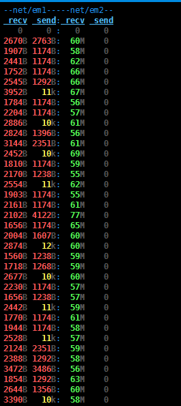
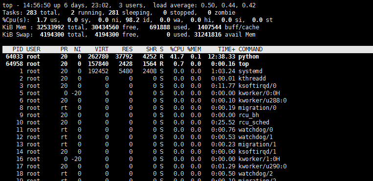
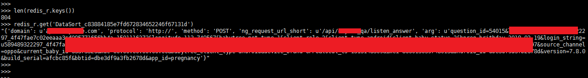

# PassiveDataSorting 0.1

自动化被动扫描系统分为数据源、数据处理、漏洞验证等三个子系统，本系统属于数据处理部分，抓取流量镜像的数据，进行分析过滤去重等操作，发送至消息队列中，等待PassiveSecCheck消费

## Author ##
咚咚呛 

如有其他建议，可联系微信280495355

## Support ##

满足如下安全需求

	1、支持大流量镜像(比如核心交换机上对负载均衡nginx或waf流量镜像)数据处理，当流量过大会主动丢弃
	2、支持流量对http解析
	2、支持按照规则进行去重、去静态、去相似等方法，已集成部分规则，另一部分规则需要按照场景和日志进行统计设定
	3、支持按照五元素json存储结果到redis(方法、协议、域名、接口、参数)

技术细节如下：

	1、基于scapy进行网卡流量数据处理，流量过大会主动丢弃部分数据
	2、基于scapy_http进行流量的http解析
	3、支持http协议的GET/POST方法，针对POST防止，暂只支持application/x-www-form-urlencoded(如body为user=test&password=123456)类型
	4、自定义url过滤规则保存在redis的中，可动态修改，支持如下：匹配任意五元素，进行放行、拦截、替换等操作，如去静态资源、去相似url、去敏感域名等。
	5、去重过滤，计算出MD5(方法+接口)值，利用redis唯一key进行去重
	6、结果redis存储Key是去重md5值，VALUE是json存储的五元素
	7、结果为反复覆盖是存储，可保持请求最新

## Test Environment ##

>centos 7
>
>python 2.7.5

## Tree ##

	PassiveDataSorting
	----lib                #模块库文件
	----run.py		   	   #程序主程序

## Deploy ##
	
	部署分为两块，一个扫描任务执行Worker、一个是ssrf漏洞验证Worker

	1、任意机子安装redis
	$ yum install redis
	$ vim /etc/redis.conf
	# 更改bind 127.0.0.1 改成了 bind 0.0.0.0
	# 添加一行requirepass xxxxx密码
	# 修改daemonize yes
	$ redis-server /etc/redis.conf
	
	2、流量镜像数据处理server
	1） $ yum install scapy
	2） $ pip install -r requirements.txt
	3） 配置./lib/config.py 文件，填入Redis和相关规则，后期可以直接在redis进行规则更改添加
	4） $ nohup python run.py &

## Config ##

配置目录：./lib/config.py

	# redis信息
	REDIS_HOST = '127.0.0.1'
	REDIS_PORT = 6379
	REDIS_PASSWORD = 'xxxxxxx'
	REDIS_DB = 0
	
	# field 代表5元素中字段名称，method/protocol/domain/ng_request_url_short/arg
	# rule 代表需要匹配的正则
	# remarks 代表备注信息
	# action代表行为，open匹配上则放过没匹配则拦截、lock匹配上拦截，replace匹配上替换
	# replace代表，当action为replace为时，匹配上的替换为replace中的字串
	conf_sniffer_rule = [
	    {'field': 'method', 'rule': '^(GE|POS)T$', 'remarks': '方法过滤只允许GET/POST', 'action': 'open'},
	    {'field': 'protocol', 'rule': '^http://$', 'remarks': '协议过滤只允许http://', 'action': 'open'},
	    {'field': 'domain', 'rule': 'www\.test\.com', 'remarks': '禁止www.test.com', 'action': 'lock'},
	    {'field': 'ng_request_url_short', 'rule': '(.+)\.(ico|mp3|js|jpg|jped|gif|xml|zip|css|png|txt|ttf|rar|gz)$',
	     'remarks': '排除静态文件', 'action': 'lock'},
	    {'field': 'ng_request_url_short', 'rule': '(\d+){5,}', 'replace': 'xxxxxx', 'remarks': '接口出现5位以上数字则把相关数字替换为xxxxx',
	     'action': 'replace'},
	    {'field': 'ng_request_url_short', 'rule': '/$', 'replace': '', 'remarks': '假如接口最后一位为/进行删除',
	     'action': 'replace'}
	]

## Screenshot ##

